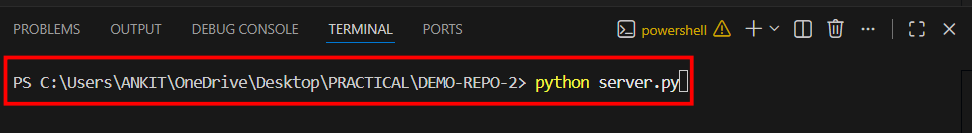
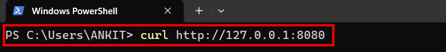
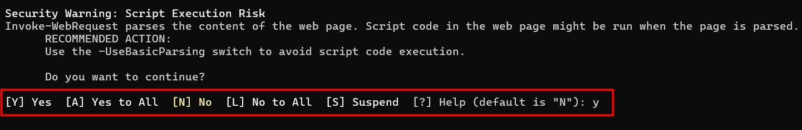
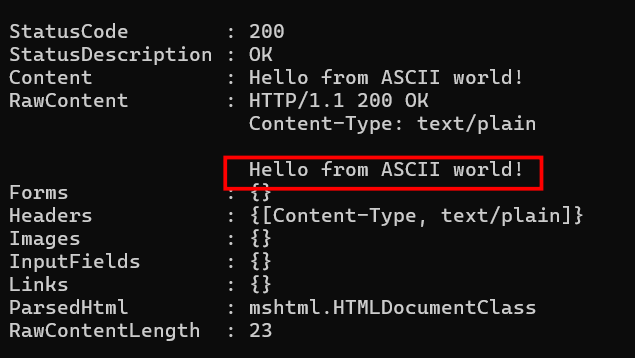
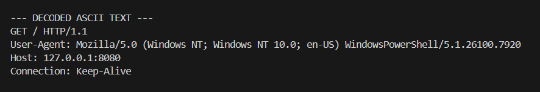

# Introduction 
we wil pratically see how does the ASCII encoding format actually works in HTTP. PRotocal.

# Tools used
1. Powershell
2. Python

# Quick start
```text
git clone https://github.com/Prabesh-collab/Task-1.git
cd Task-1
```

# Procedure
Here is a detailed step by step process to see how does ASCII works in the HTTP.

## Step1: Run the server.py file.
The first task of the process is to run server.py file in the terminal of vs code. for that use the below command.
```text
python server.py
```



Now the terminal will start listening.

## Step2: open seperate terminal and transmit request.
After running the python file. Open a terminal in your computer and enter the below command.
```text
  curl http://127.0.0.1:8080
```



after running this command it will ask for permission to connect to the remote server. Enter (y) this will give the permission.


When we give them the permission it will ask the server data in ascii.


## Step3: open the terminal where you ran the python file.
After transmitting the request the terminal at your python file will receive the data in encoded format.



# Conclusion
This experiment successfully demonstrated that the HTTP/1.1 protocol functions fundamentally as a text-based communication system powered by ASCII encoding. By utilizing a raw Python socket server to intercept a curl request, the following key insights were observed:

Standardized Translation: The experiment proved that every character of an HTTP request (e.g., GET, Host, User-Agent) corresponds to a specific numerical value in the ASCII table, allowing different systems to communicate using a universal "alphabet."

Protocol Structure: The observation of Control Characters, specifically the Carriage Return (\r) and Line Feed (\n), highlighted how ASCII is used not just for content, but as the structural "glue" that signals the end of headers and the start of data.

Data Correlation: By analyzing the RawContentLength, a direct 1:1 relationship between the number of ASCII characters sent and the total bytes of data received was confirmed (e.g., a 23-character string equals exactly 23 bytes).

Hardware-to-Software Bridge: Ultimately, the process showed how high-level human intent is serialized into a stream of ASCII-encoded integers for network transmission and subsequently decoded back into readable text by the receiving server.